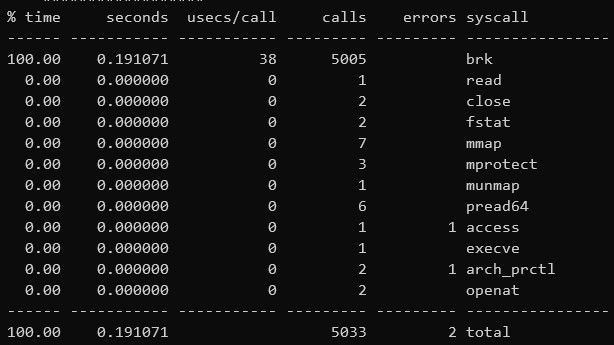
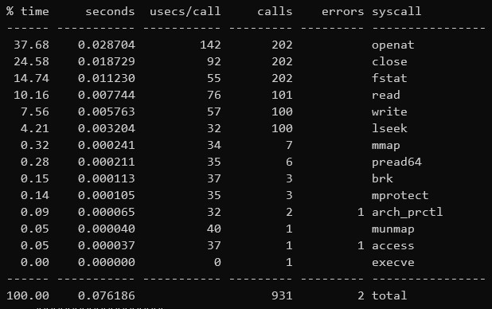
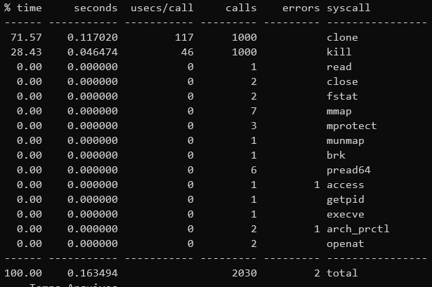
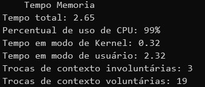
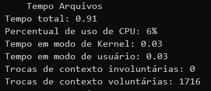
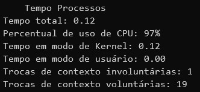

# Relatório Módulo 1

Para este módulo foram desenvolvidos três programas distintos, cada qual com o seu foco entre chamadas de sistema relacionadas a Arquivo, Memória ou Processos. Serão escolhidas ao menos 3 primitivas para cada uma das categorias e estas serão analisadas com relação ao tempo de execução em modo de Kernel e de usuário, à quantidade de trocas de contexto e à quantidade de vezes que ela é chamada em cada um dos programas.


# Instruções Para Execução dos Códigos

Foi criado um script `run.sh`, que se encontra na pasta `Módulo 1` deste repositório. Ao rodar este programa ele irá compilar os diferentes códigos utilizando o compilador `gcc` e irá executar os comandos `strace` e `time`. É necessário que os 3 estejam instalados, o que é o padrão em uma distribuição como o Ubuntu 18.04 LTS.

É importante clonar todo o repositório, dado que para o programa relativo aos Arquivos, por exemplo, é necessário o uso de 2 arquivos de texto adicionais, já presentes no Github.

## Identificação e Descrição das Chamadas de Sistema

Por meio do comando strace são identificadas as chamadas de sistemas nas tabelas abaixo, referentes às primitivas de memória, processos e arquivos, respectivamente. As suas breves descrições estão nestas mesmas tabelas. 

### Chamadas de Memória
|syscall| descrição  |
|:--|--|
| brk | desloca o fim do segmento de dados para um valor especificado, desde que o tamanho do processo não exceda o máximo permitido |
| mmap | cria um novo mapeamento no espaço de endereçamento virtual do processo chamado |
| munmap | deleta o mapeamento feito em um intervalo de endereços dado. É feito automaticamente quando o processo termina |
| mprotect | Define uma proteção para uma dada região de memória, como read only, write, etc. |
| time | Retorna o tempo em segundos passados desde 01/01/1970. Caso não seja nulo, o valor de retorno é guardado no valor da memória passado pelo parâmetro. |

### Chamadas de Processos
|syscall|descrição  |
|:--|--|
| execve | Executa o programa apontado no parâmetro, o qual deve ser um executável binário ou um script. |
| kill | Envia um sinal para o procesos ou grupo especificado. No caso utilizado é enviado o sinal SIGKILL, que o mata. |
| clone | Cria um novo processo. É utilizado pelo comando fork do C. Ao contrário da syscall fork ele permite que o processo divida partes da sua execução com o seu pai. |
| getpid | Retorna o identificador (ID) do processo. |
| arch prctl | Defina o processo ou thread específico de determinada arquitetura, selecionando uma subfunção e passando como argumento para a chamada de sistema. |


### Chamadas de E/S e Arquivos
|syscall|descrição  |
|:--|--|
| access | Checa se o processo tem acesso requisitado ao arquivo dado. É feita utilizando o UID e GID real do processo, ao invés do ID virtual, assim determinando com facilidade a autoridade do usuário. |
| read | Lê um número de bytes, passados por parâmetro, de um arquivo e armazena em um buffer. |
| write | Funciona de forma semelhante ao read, mas escrevendo até o número de bytes passados pelo parâmetro com base nos dados do buffer. |
| close | Fecha um dado descritor de arquivo aberto anteriormente, assim fazendo com que ele possa ser reutilizado e qualquer ligação que o arquivo com, ou possuída pelo processo, são removidas. |
| fstat | Retorna o status de um dado arquivo, sendo esse status informações sobre o arquivo, como permissão, id, inode, tamanho do bloco, grupo, etc. |
| lseek | Reposiciona o offset (em bytes) do arquivo para leitura/escrita, podendo ser a partir de um certo local especificado, o tamanho do arquivo ou a referência zero. |
| openat | Abre e, se necessário, cria um arquivo em um endereço dado. Podendo ser utilizado, portanto, em chamadas ao sistema subsequentes. |

## Tempo e Frequência de Chamadas ao Sistema

Por meio do comando `strace -c` é possível obter as seguintes saídas, que mostram o tempo de cada chamada ao sistema e a sua frequência em cada um dos programas.

Resultado do `strace` para o programa relativo à Memória



Resultado do `strace` para o programa relativo aos Arquivos




Resultado do `strace` para o programa relativo aos Processos



Como é possível ver pela saída dos comandos de fato tem-se as primitivas analisadas anteriormente.

## Análise de Tempo de Execução

Utilizando o comando time, juntamente com a flag `-f` para a especificação dos parâmetros adicionais solicitados, tem-se as saídas nas imagens abaixo

```bash
$ /usr/bin/time -f "Tempo total: %e
Percentual de uso de CPU: %P
Tempo em modo de Kernel: %S
Tempo em modo de usuário: %U
Trocas de contexto involuntárias: %c
Trocas de contexto voluntárias: %w" ./a.out
```

Resultado do comando `time` para o programa relativo à memória



Resultado do comando `time` para o programa relativo aos arquivos



Resultado do comando `time` para o programa relativo aos processos



## Análise CPU/I-O Bound

Como mostrado pelas saídas do comando `time` da sessão anterior, os programas possuem características que os distinguem facilmente.

Um exemplo claro é a comparação entre os programas referente às primitivas de Memória e o programa referente às primitivas de Arquivos. Enquanto o primeiro possui alta porcentagem de uso de CPU (99%), o segundo possui este mesmo percentual valendo 6%.

Por meio desta comparação, já seria possível ter fortes indícios que o processo referente aos Arquivos é I/O Bound enquanto o de Memória é CPU-bound.

Outra estatística que corrobora para esta afirmação é o número de trocas de contexto voluntárias do processo de arquivos, que é alto, enquanto no processo de memória este número é baixo.

Esperaria-se que no caso de memória, por serem operações demoradas, haveria um maior número de trocas involuntárias, porém isto não ocorreu por haver poucos processos competindo pela CPU no momento em que este foi executado.

