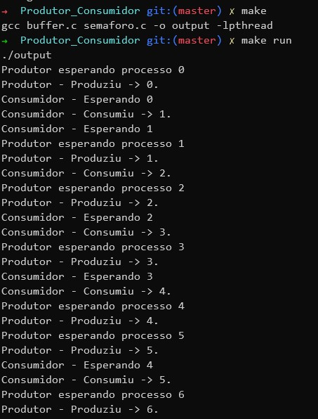

# Relatório Módulo 2

Para este módulo foi desenvolvido um programa principal que exemplifica o problema do Produtor x Consumidor, que, por meio do uso de semáforos, controla o acesso a um buffer compartilhado, onde itens serão adicionados e consumidos por diferentes threads da biblioteca pthreads, conforme a especificação.

# Instruções Para Execução do Código

Para compilar o código basta utilizar o comando `make` dentro da pasta `Produtor_Consumidor`. Isto gerará um arquivo `output` que pode ser executado com `./output` ou `make run`. 

# Exemplo de execução

Um exemplo de compilação e execução do código encontra-se na imagem abaixo.

# Especificação do código

O código foi dividido em 2 partes, 

- A manutenção do buffer: Gerência de operações de inicialização, adição e remoção dos itens do buffer.
- O produtor-consumidor: Duas funções que, por meio de semáforos, controlam o acesso a recursos da região crítica acessada pelas duas threads em execução simultânea.

# Requisitos

- O programa deve ter um buffer limitado, acessível a qualquer processo decorrente do processo principal;
    - O Buffer `buf` foi criado e é acessado por meio de qualquer um dos dois processos por meio do parâmetro passado a eles.

- O programa deve ter uma fila apontando para o próximo endereço livre, a ser escrito;
    - A fila é representada pela variável `in`, que representa o próximo offset do endereço livre a ser escrito.

- O programa deve ter uma fila apontando para o próximo endereço ocupado, a ser lido e liberado;
    - A fila é representada pela variável `out`, que representa o próximo offset do endereço a ser lido e liberado.

- O programa deve controlar as seções críticas (Compartilhamento de memória), para que não haja acessos indevidos.
    - Ao utilizar semáforos o programa controla essas seções críticas para que não ocorra o acesso indevido.

- O programa deve ter a capacidade de colocar um processo em modo de espera;
    - Ao utilizar sem_wait o processo pode ser colocado em espera caso seja necessário.

- O programa deve ter a capacidade de controlar quando um processo está em espera, para poder "chamar" o mesmo;
    - Por meio dos semáforos este controle é feito.

- O programa deve controlar quantos endereços estão livres e quantos endereços estão ocupados.
    - Ao ter as variáveis in e out tem-se exatamente quantos endereços estão livres ou não.