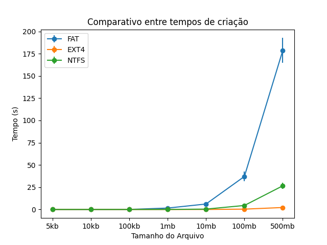

# Módulo 4

Este modulo foi desenvolvido para comparar alguns dos sistemas de arquivos existentes, de forma que a comparação contém criação, leitura e exclusão de arquivos em cada tipo de sistema de arquivo. Uma breve explicação dos tipos de sistemas de arquivos é apresentado assim como a execução dos códigos implementados e os resultados obtidos.

## Sistemas de arquivos 

É possível armazenar e recuperar uma grande quantidade de informação, desta forma permite ao sistema operacional poder ler e gravar dados nos arquivos ou poder criar arquivos. Possui como tarefas estruturar os arquivos, os nomes, os tipos de acessos, sua proteção e a sua implementação. Existem diversos tipos de sistemas de arquivos como o ext, ntfs e o fat32.

### Fat32
O sistema de arquivo fat (Tabela de alocação de arquivos) foi desenvolvido para o MS-DOS e consiste em uma tabela na memória que armazena o ponteiro do bloco. Porém existia alguns limites  para os nomes dos arquivos que eram curtos e não existia o conceito de diferentes usuários, de forma que todos os arquivos podiam ser acessados por todos os usuários. Assim, com o intuito de superar o limite do tamanho de volume dos arquivos, surge o Fat32. Consequentemente o tamanho dos blocos aumentaram possuindo assim 4KB, 8KB, 16KB e 32KB e também o tamanho da partição aumentou para 2TB.

### NTFS
O ntfs (new technology filesSystem) é o sistema de arquivos padrão para o Windows NT e seus derivados. Possui algumas características do sistema de arquivo HPFS (high performance
file system - sistema de arquivos do OS/2). O NTFS possui uma estrutura que armazena as localizações de todos os arquivos e diretórios, incluindo os arquivos referentes ao próprio sistema de arquivos denominado MFT (Master File Table). Possui como característica sua confiabilidade, que gera a capacidade de se recuperar de problemas sem perda de dados e possui melhor tolerância a falhas. Aceita volumes de até 256TB utilizando tamanho de cluster de 64KB;

### Ext4
O ext4 é um sistema de arquivos de registro para Linux, desenvolvido para ser o sucessor do ext3. Assim, o ext4 perimiut a criação dos extents que é um conjunto de blocos físicos contíguos, o que, para arquivos grandes, faz aumentar o desempenho e reduzir a fragmentação. O ext4 assim como o ext3 possuem um registro de ações que é chamado de journling. O o journaling grava todas as mudas e usa um arquivo de registro de ações maior, só que este tipo pode ser mais lento mas possui maior capacidade de evitar perdas.

## Instrução para execução
Para compilar o código é necessário executar o comando make para que gere um arquivo de execução. E assim, o script `test.py`, em python3, presente na pasta `Códigos` foi desenvolvido que executa todas as opções e mostra os resultados.

Para executá-lo basta utilizar o comando `python test.py`.

Caso algum problema de biblioteca ocorra pode ser necessário instalar a biblioteca matplotlib, do python, o que varia com base na distribuição utilizada.

## Resultados

### FAT

### NTFS
A execução no sistema de arquivos ntfs.

### EXT4
A execução no sistema de arquivos ext4.

## Comparativos

### Criação de Arquivos

### Exclusão de Arquivos

### Leitura de Arquivos

### Resultados das execuções
Os resultados obtidos demonstraram que a operação de criação de um arquivo é a que demanda mais tempo para sua execução e a operação de exclusão é a que demora menos tempo. Em relação ao tempo para cada tamanho de arquivo é possível observar que conforme o tamanho do arquivo aumenta, maior é o tempo de uma operação. Em relação em comparação dos três tipos escolhidos de sistemas de arquivos foi constatado que o sistema de arquivo fat32 foi que obteve os maiores tempos de execução das operações demonstrando que não é tão eficiente em comparação aos outros tipos de sistemas de arquivos para arquivos grandes. O sistema de arquivo ntfs obteve melhores tempos em relação ao fat32, porém comparado com o ext4 não. Dado que os resultados do ext4 os tempos ficaram abaixo de 4 segundos para qualquer tipo de operação. Sendo assim, o ext4 se sobressaiu sobre todos os sistemas de arquivos verificados.

Os resultados numéricos para as 3 execuções se encontram no arquivo `comparativo.py`, com um exemplo de geração de imagem de comparação.

## Especificação do código

O código foi dividido em três arquivos sendo cada arquivo para um tipo de operação existente, como um para criação, leitura e exclusão de arquivos. E para cada tipo de operação, foi realizado uma verificação com o tamanho variado dos arquivos, sendo os tamanhos 5Kb, 10Kb, 100Kb, 1Mb, 10Mb, 100Mb e 500Mb, assim medindo o tempo de execução para cada tamanho.

Para a medição do tempo foi utilizada a função `gettimeofday`, que dá maior precisão do que utilizar a biblioteca `time` por si.
Além disso, como garantia, foram medidos quantos ciclos de cpu cada uma das execuções leva, porém não foi necessário utilizar tais medidas para a criação dos gráficos dado que elas geravam apenas redundância.
